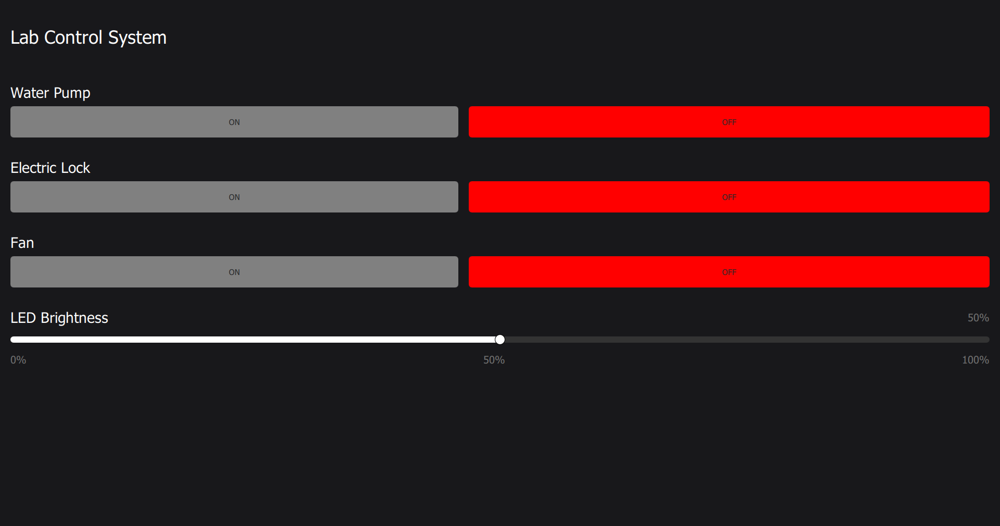
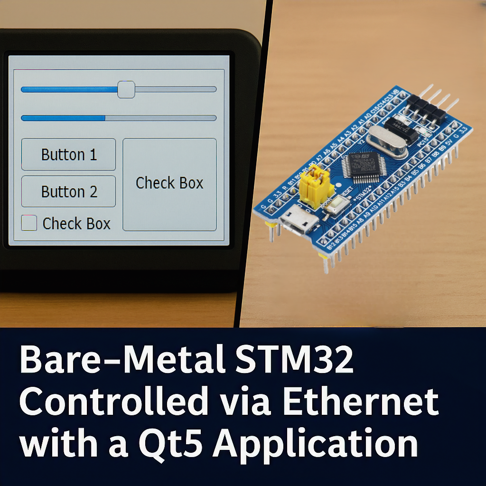

# Qt5 GUI → STM32 (Bare Metal) via Ethernet (CH9121)

This project demonstrates how a **Qt5 application running on Raspberry Pi 5** controls a **bare-metal STM32F103** microcontroller over Ethernet (via CH9121 ETH2UART chip), using a **custom TCP-based protocol**. The setup enables **real-time relay control** through a touchscreen GUI without relying on X11 or Wayland.



[](https://youtube.com/shorts/BL4TQFjsRmY?si=G8JpCt_BM3iExTb5)

*(Click the image to open YouTube video demo.)*

---

## 🔧 Features

- 🧠 Full-stack embedded setup: from Qt GUI to STM32 firmware
- ⚡ Real-time control of relay modules via TCP commands
- 🔌 CH9121 ETH2UART bridge used for STM32 Ethernet connectivity
- 🖥 GUI rendered with **Qt5 EGLFS** — no X11/Wayland
- 🛠 STM32 runs **bare-metal C** (no HAL, no RTOS)
- 📡 UTF-8 command parsing on STM32 side
- 🔁 CH9121 configured via UART (initial config firmware before main logic)
- 🐧 Autostart via `systemd` with splashscreen and shell script

---

## 📦 Hardware Used

- Raspberry Pi 5 (Qt5 GUI host)
- STM32F103C8T6 (Blue Pill)
- CH9121 (ETH2UART bridge)
- Relay Module (controlled by STM32)

---

## 🗂 Folder Structure

| Folder            | Description                             |
|-------------------|-----------------------------------------|
| `qt_app/`         | Qt5 GUI application                     |
| `stm32_firmware/` | STM32 C code for TCP + relay control    |
| `system/`         | Linux configs: systemd, splash, scripts |
| `docs/`           | Screenshots, diagrams, thumbnails       |

---

## 🚀 Quick Start

### Qt GUI (on Raspberry Pi)
```bash
cd qt_app
mkdir build && cd build
cmake ..
make
./your_app -platform eglfs
````

### STM32 (Bare Metal Firmware)

1. Upload CH9121 configuration firmware to setup ETH2UART as TCP client.
2. Then flash the main logic firmware.
3. Ensure CH9121 connects to the Raspberry Pi TCP server.

### Systemd Setup

```bash
sudo cp system/myqtapp.service /etc/systemd/system/
chmod +x system/runqt.sh
sudo systemctl daemon-reload
sudo systemctl enable myqtapp.service
sudo systemctl enable splashscreen.service
```


---

## 📡 Protocol Overview

* Qt app acts as **TCP server**, listening for connections.
* STM32 (with CH9121 as client) connects and sends messages in **UTF-8 encoded strings**.
* STM32 parses messages and triggers relays accordingly.

---

## 📌 Author & Skills Demonstrated

**Author**: [@alibeknakhimov](https://github.com/alibeknakhimov)
**Roles**:

* STM32 bare-metal firmware development (no HAL)
* TCP server implementation with Qt5 GUI
* CH9121 UART-based configuration
* Systemd-based autostart and EGLFS GUI setup without X11/Wayland
* Splash screen and headless device initialization

